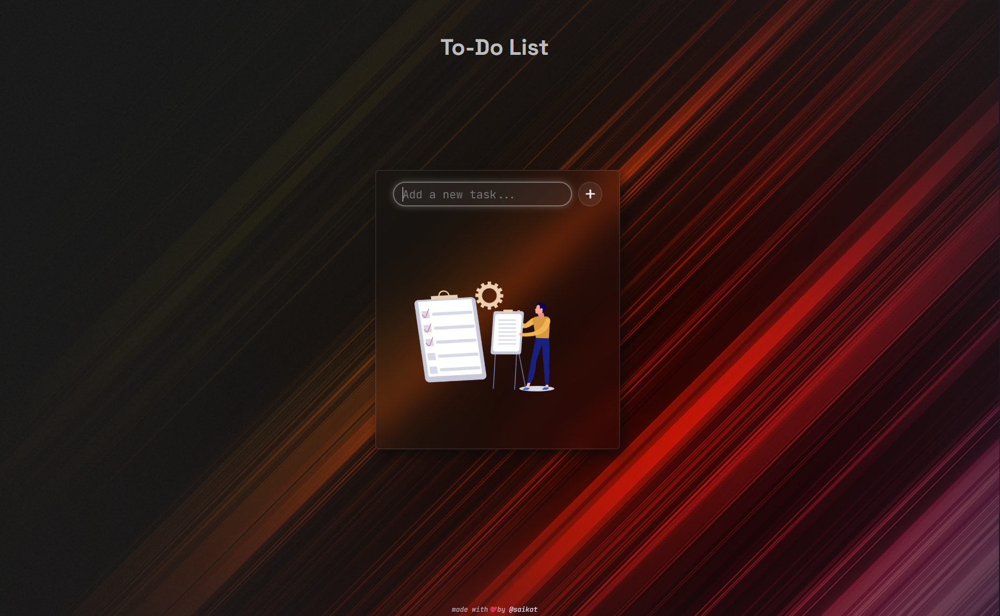

# To-Do List App 📝

A simple **To-Do List web application** built with HTML, CSS, and JavaScript.  
Features **add, delete, and mark tasks as completed**, with **Local Storage persistence** and **confetti animation** when tasks are completed.  



---

## 🚀 Features

- Add new tasks easily
- Mark tasks as completed (line-through style)
- Delete tasks individually
- Confetti animation when a task is completed
- Input bar pinned at the top for easy access
- Scrollable task list if tasks overflow
- Responsive and clean UI

---

## 🗂️ Folder Structure


todo-list-app/
├── assets/
│   └── empty-todo.png
├── index.html
├── style.css
└── script.js


---

## ⚙️ How to Run Locally

1. Clone the repository:

```bash
git clone https://github.com/your-username/todo-list-app.git

``` 

2. Navigate to the project folder:

 ```bash
   cd todo-list-app
```
3. Open index.html in your favorite browser:
  ```bash
open index.html
# or just double-click index.html in your file explorer
```
4. Start adding your tasks!

# 💻 Usage

- Type a task in the input box and press Enter or click the plus button.

- Click a task to mark it as completed — a confetti animation will play.

- Click the red Trash Can next to a task to delete it.

# 🌐 Live Demo

You can see the live demo of this app hosted on GitHub Pages:

Live Demo [https://saikat-codes.github.io/js-todo-list/](https://saikat-codes.github.io/js-todo-list/)


# 🎨 Technologies Used

- HTML5

- CSS3 (Flexbox layout)

- JavaScript (ES6)

- [tsparticles.confetti](https://confetti.js.org/more.html)
 for confetti animation.

# 👤 Author

Made with by [Saikat Das](https://www.linkedin.com/in/saikat-das-698a5b2a2/)

